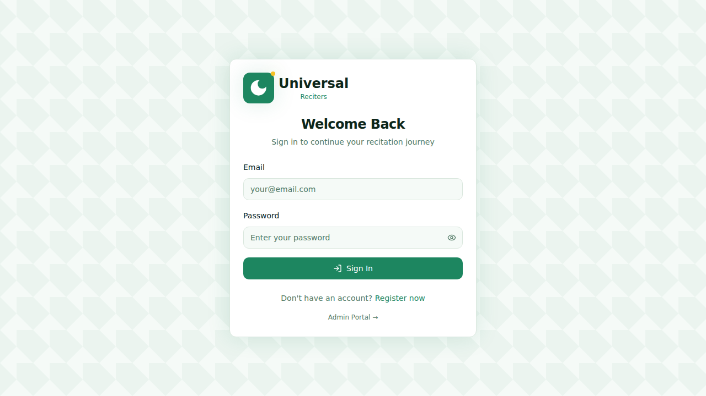
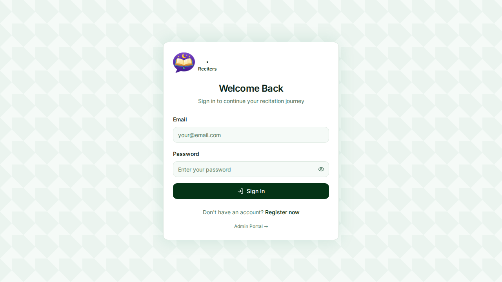
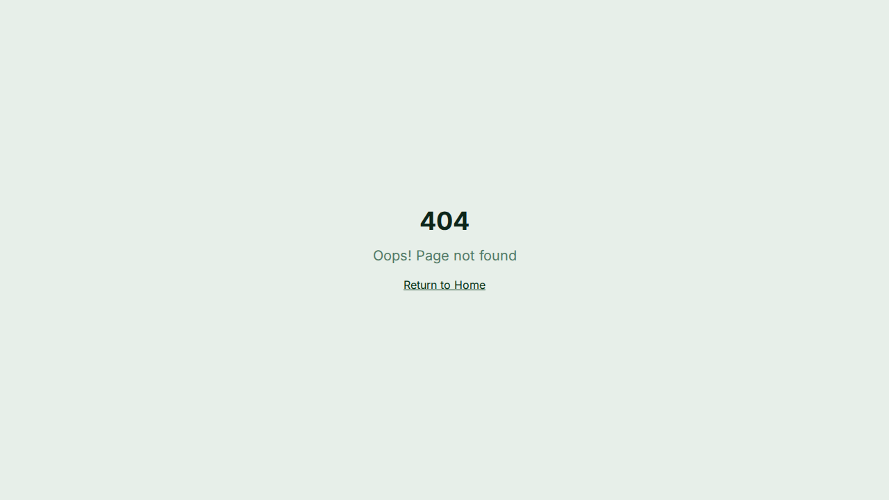

# Universal Reciters

Universal Reciters is a comprehensive platform for Quranic recitation practice, learning, and community engagement.

## 🚀 Features

### User Dashboard
- **Recitation Practice**: Select a Surah and practice your recitation with real-time AI feedback.
- **Video Unlocking**: Access premium recitation videos by unlocking them using your wallet balance.
- **Leaderboard**: Compete with others and climb the ranks based on your recitation scores and points.
- **Chat**: Connect with friends through a simple, text-based chat interface.

### Admin Dashboard
- **Comprehensive Stats**: Track Total Revenue, User Balances, and Points across the platform.
- **User Management**: Create, edit, and manage user profiles. Admin-led wallet balance updates and pagination.
- **Content CMS**: Manage recitation videos, Surah texts, and learning materials.
- **Wallet Control**: Handle withdrawal requests and generate redemption PINs.

## 📸 Screenshots

| Login Page | User Dashboard |
| :---: | :---: |
|  |  |

| Recitation Practice | Admin Dashboard |
| :---: | :---: |
|  |  |

| User Management | Chat Interface |
| :---: | :---: |
|  |  |

## 🛠️ Technology Stack

- **Frontend**: Vite, React, TypeScript, Tailwind CSS, shadcn-ui, Lucide Icons
- **Backend**: Supabase (Database, Auth, Storage, Edge Functions)
- **State Management**: React Query, Auth Context

## 📖 Documentation

For more detailed technical information, please refer to the [Documentation](./DOCUMENTATION.md).

## 🚀 Getting Started

1.  **Clone the repository**:
    ```sh
    git clone <YOUR_GIT_URL>
    ```
2.  **Install dependencies**:
    ```sh
    npm install
    ```
3.  **Start the development server**:
    ```sh
    npm run dev
    ```
